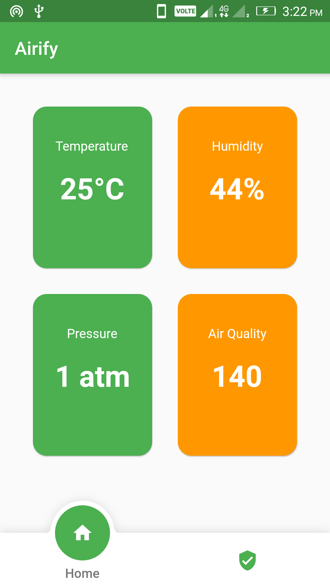
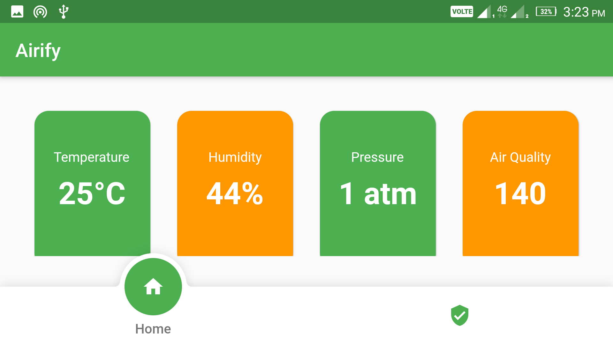
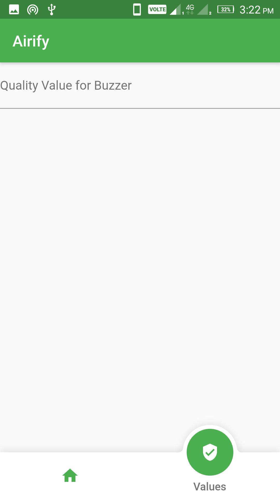

# airify

A new app in flutter that is IOT based and made for get data of air with some sensors using esp32

## Feature
<ul>
<li> Show realtime data of Air Quality and Weather if ESP32 Based System is on.</li>
<li> We can set the value of Air Quality for which the buzzer should be on at this minimum value. <li>
</ul>

## Contributing
Contributions are welcome! However, if it's going to be a major change, please create an issue first. Before starting to work
on something, please comment on a specific issue and say you'd like to work on it.

